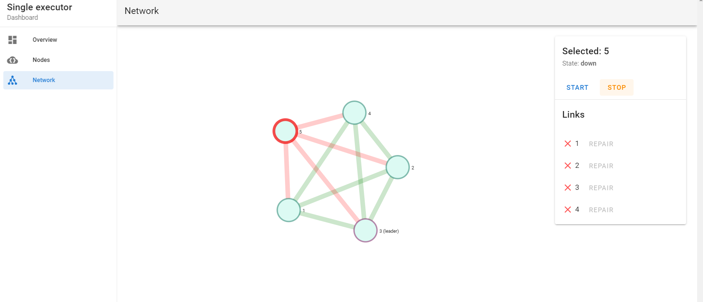

# Single executor

A hobby project written in Go.

**Please note that this is a work in progress, so the code is not well tested/documented, and there are many improvements that could be made to maintainability, performance and security.**

## The problem

How do we keep a process running on a single machine in a highly-available solution.
The following assumptions are made:
* It is _critical_ that the process only ever runs on _at most one_ machine at a time.
* The process being run can be any arbitrary binary, but we must not modify it.
* It is okay for the process to not be running during fail-over, but this downtime should be mitigated.
* The system should automatically self-correct.
* The nodes are all "trusted"; non-BFT is not required.

## The solution

Our solution to this problem is an adaption of [Raft leader election](https://en.wikipedia.org/wiki/Raft_(algorithm)#Leader_election).

The configured nodes will elect amongst themselves a leader. When a leader
is elected, the process will start on that node. Note that we require a majority
across the whole network for a leader to be elected, so in the case of a 50/50 split
brain problem, no leader will be elected.

Leadership is temporary, for as long as the leader receives heartbeats from the majority
of its followers (again, a cluster-wide majority must be reached). If this majority
is not reached within a given time window, leadership will be relinquished and a new
election will start.

Whilst leadership is held, the accompanying binary will be run on that node.
Some grace periods will be granted between starting/stopping the process
so that we never overlap execution. Note this is not yet implemented.

### Known Limitations
* Static configuration. The network needs to be brought down to add/remove nodes.
* The system handles up to 50% node failures. If more than 50% of the connected
  nodes fail, the binary will not run.
* Non-BFT. This solution assumes there can be no bad actors.
* Transport is currently insecure.

### Future additions

* A separate node monitoring component, that can force a watchdog instance
  to drop leader when the network/node is not healthy.
* Support for two modes of recovery:
  * Automatic: as with the current solution, the nodes will automatically elect a new leader when one goes down.
    In this configuration, the system is self-healing.
  * Manual: the watchdog instances will require manual activation
    to leadership state. The network will still hold election, but in this
    configuration, it would require an active confirmation from a human
    to proceed to an active leader state. In this configuration, there is more
    control of the system. This would be useful to test/prove the automatic recovery
    system before switching to it.

## Components

`watchdog` is the core component that implements the distributed algorithm. Note that
there are some concepts in this component to allow demonstration (such as app-level blacklisting
of other nodes in the network to simulate network connectivty issues/split-brain problem).

The other components in this repo are present to facilitate development and demonstration
of the core `watchdog` component. These are:
* `demoserver` - a simple HTTP application that displays info of the system state
* `chain` - a node which emulates an external system/node (such as a blockchain).
  This simply listen for incoming signatures and records them. The signing history
  can be seen in JSON via an HTTP call.
  Note this is not hooked up in the test system/dashboard yet.
* `binary` - a simple producer for the `chain`. For demonstration purposes, this
  is the executable that we only ever want to be running once. In a real system, this
  could be any executable. For now, we can observe the signing history on `chain` to test
  whether or not one binary is running.
  Note this is not hooked up in the test system/dashboard yet.

## Installation

Requirements:
* `docker` (developed on v19.03.12)
* `docker-compose` (developed on 1.27.2)

To compile everything and bring up a test system with dashboard,
```
docker-compose run --rm dev make && docker-compose -f docker-compose.system.yaml up --build
```

Then navigate to `http://localhost:8081/dashboard`.

### Dashboard
Each watchdog instance state is displayed,


The event log for each indicates what has happened. For example, here
we have killed the leader and the system has elected a new leader.


Network issues can be simulated by blocking access to individual 
nodes on the network. This can be used to test split brain conditions.
